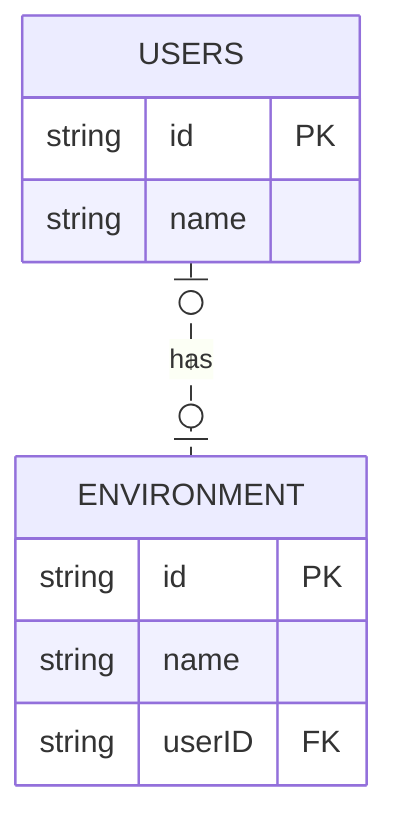
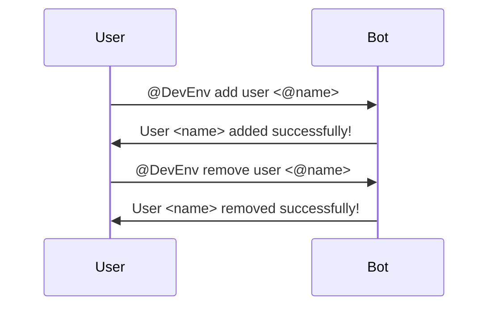
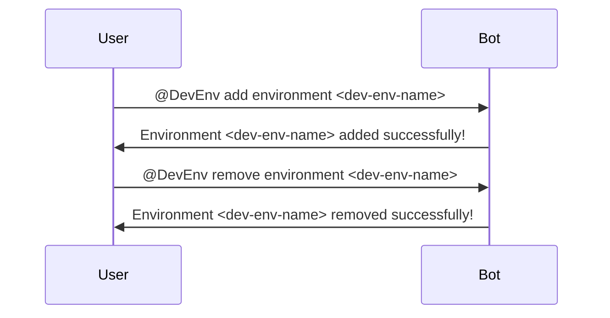
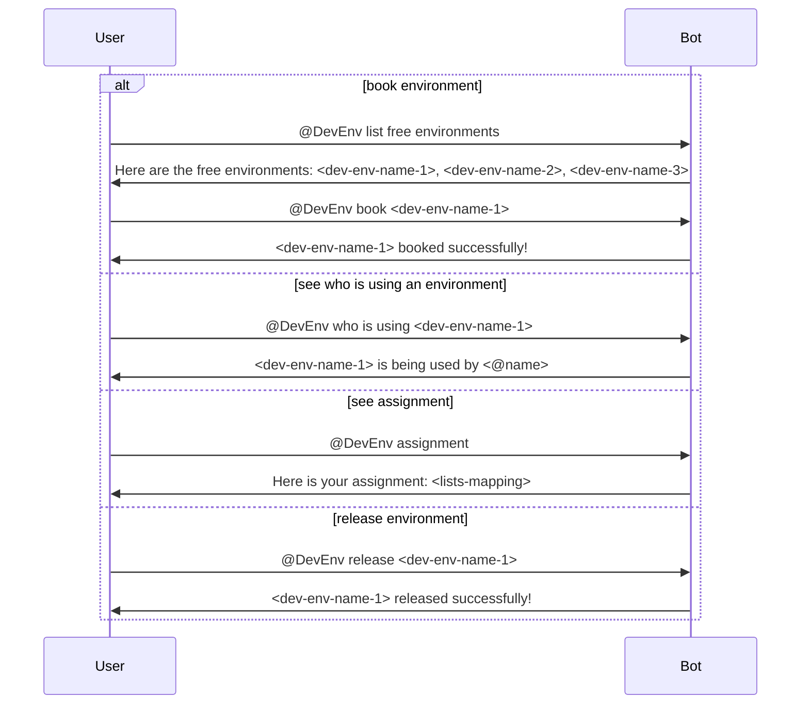

# That's my DevEnv!

This slack bot will be helpful for teams who have many development environments and want to book them for their projects.

## Objective

The bot will be designed to be used in a slack channel. The bot will be able to book a development environment for a user and will be able to release the environment when the user is done with it.

## Features

- [ ] The bot will be able to book a development environment for a user.
- [ ] The bot will be able to release a development environment when the user is done with it.
- [ ] Any user can take a look at the available development environments.
- [ ] Any user can query the bot to know who is using a specific development environment.

## Technologies

- NodeJS
- Typescript
- SQLite
- Prisma
- Slack API (Slack Bolt)

## Entities

- Users
- Environments

## Design

### Schema

A user can have 0 or 1 environments at a time, and an environment can be used by only 1 user at a time.

### User CRUD Conversation

### Environment CRUD Conversation

### Book Environment Conversation

## References

- [Slack Bolt](https://slack.dev/bolt-js/concepts)
- Inspired by [Rota Bot](https://github.com/kmaida/rota-slackbot)
- [Prisma](https://www.prisma.io/)